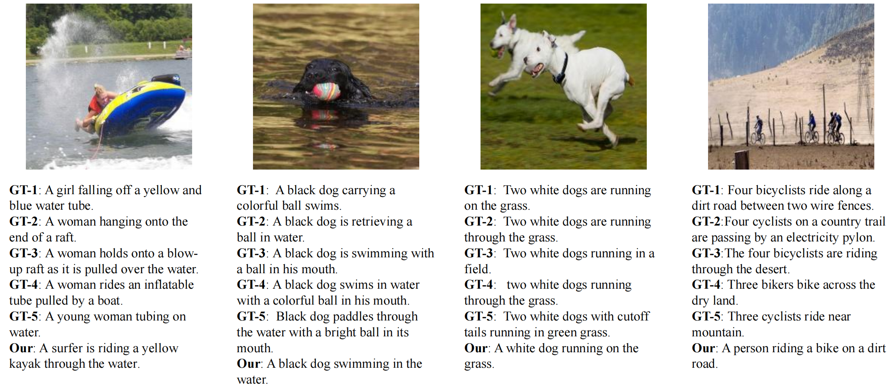

This repository contains the implementation for the **Underwater Image Captioning with AquaSketch-Enhanced Cross-Scale Information Fusion**

- **Python**: 3.6.9  
- **PyTorch**: 1.7.1  
- **Torchvision**: 0.8.2  

### Datasets

- The **PESEmphasis5k** dataset requires authorization from the authors of the paper *“Generating Captions for Underwater Images Using Deep Learning Models”*. You can find the paper [here](https://www.researchgate.net/profile/Rama-Penikalapati/publication/331221798_Generating_Captions_for_Underwater_Images_Using_Deep_Learning_Models/links/5cd510c192851c4eab91237d/Generating-Captions-for-Underwater-Images-Using-Deep-Learning-Models.pdf).
- The **UICD** (Underwater Image Captioning Dataset) is available at the following repository: [UICD Dataset](https://gitee.com/LHY-CODE/UICD).

### Usage

Once the datasets are downloaded and preprocessed, you can execute the training and testing scripts as follows:

```bash
python train.py
python test.py
```


### Some visualization examples




### Acknowledgments

This work builds upon the following repositories:

- [Self-Critical Sequence Training](https://github.com/ruotianluo/self-critical.pytorch)  
- [S2-Transformer](https://github.com/zchoi/S2-Transformer)
- [M2-Transformer](https://github.com/aimagelab/meshed-memory-transformer)
